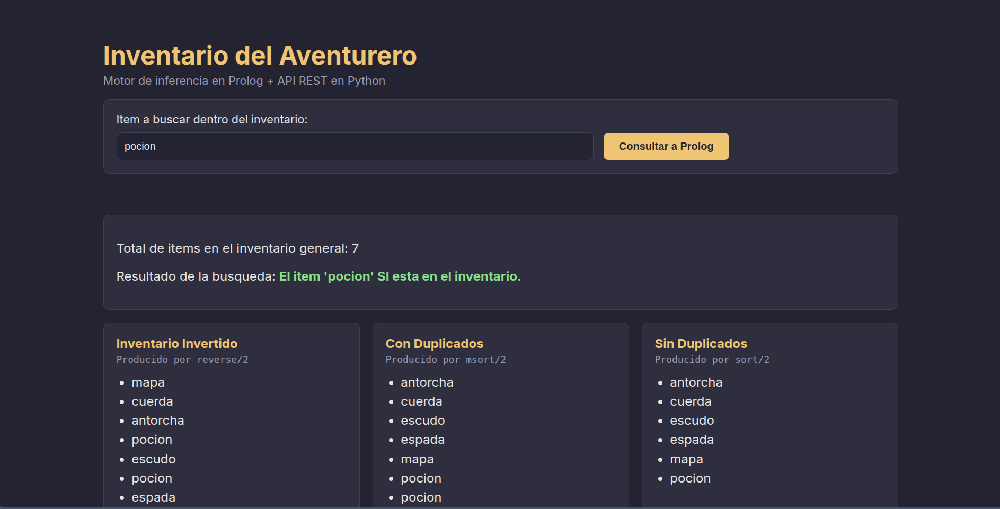
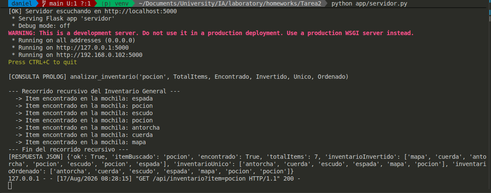
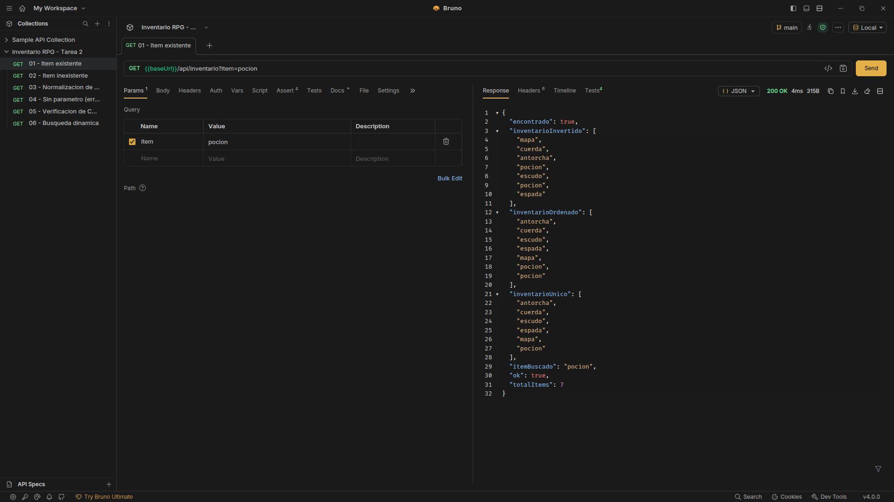

# Tarea 2

## Índice

- [1. Qué hace el proyecto](#1-qué-hace-el-proyecto)
- [2. Paso a paso](#2-paso-a-paso)
- [3. Detalle técnico por fase](#3-detalle-técnico-por-fase)
  - [Fase 1: `app/inventario.pl`](#fase-1-appinventariopl)
  - [Fase 2: `app/servidor.py`](#fase-2-appservidorpy)
  - [Fase 3: `app/web/`](#fase-3-appweb)
- [4. Cómo levantarlo y bajarlo](#4-cómo-levantarlo-y-bajarlo)
  - [4.1 Instalación](#41-instalación-una-sola-vez)
  - [4.2 Levantar](#42-levantar)
  - [4.3 Bajar](#43-bajar)
  - [4.4 Cambiar el puerto](#44-cambiar-el-puerto)
  - [4.5 Probar solo el motor Prolog](#45-probar-solo-el-motor-prolog-sin-python)
- [5. Probar el endpoint con Bruno](#5-probar-el-endpoint-con-bruno)
  - [5.1 Desde la aplicación de escritorio](#51-desde-la-aplicación-de-escritorio)
  - [5.2 Desde la terminal (Bruno CLI)](#52-desde-la-terminal-bruno-cli)
  - [5.3 Peticiones incluidas](#53-peticiones-incluidas)
- [6. Peticiones equivalentes con curl](#6-peticiones-equivalentes-con-curl)
- [7. Capturas de ejecución](#7-capturas-de-ejecución)


## 1. Qué hace el proyecto

El programa simula a un aventurero de un videojuego RPG que tiene dos bolsas de ítems. El sistema las une en un
**Inventario General** y responde, para el ítem que el usuario escriba en la página web:

| Dato devuelto | Predicado de Prolog que lo produce |
| :--- | :--- |
| Inventario General (unión de las dos bolsas) | `append/3` |
| Total de ítems | `length/2` |
| Si el ítem buscado existe o no | `member/2` |
| Inventario invertido | `reverse/2` |
| Inventario ordenado **sin** duplicados | `sort/2` |
| Inventario ordenado **con** duplicados | `msort/2` |

Además, cada consulta imprime el inventario ítem por ítem **en la consola del servidor**
mediante un predicado recursivo.

---

## 2. Paso a paso

Paso a paso:

1. El usuario escribe un ítem y envía el formulario. `script.js` intercepta el evento
   `submit` con `preventDefault()` para que la página no se recargue.
2. `fetch()` arma la URL `http://localhost:5000/api/inventario?item=<lo escrito>` y la
   pide de forma asíncrona (`async/await`), sin congelar la interfaz.
3. Flask recibe la petición en la ruta `/api/inventario`, lee el parámetro con
   `request.args`, lo normaliza a minúsculas y lo inyecta dentro de la consulta:

   ```
   analizar_inventario('pocion', TotalItems, Encontrado, Invertido, Unico, Ordenado)
   ```

4. PySwip ejecuta la consulta sobre el motor de SWI-Prolog que ya tiene cargado
   `inventario.pl`. Prolog **unifica** las cinco variables en mayúscula con sus
   resultados y, como última instrucción de la regla, llama al predicado recursivo
   `mostrar_inventario/1`, que imprime cada ítem en la consola del servidor (4b).
5. Python toma el diccionario `Variable → Valor` que devolvió PySwip, convierte cada
   valor a un tipo serializable y responde con `jsonify()`.
6. `script.js` recibe el JSON, crea un `<li>` por cada elemento de cada lista y los
   inserta en el DOM. Nada está escrito a mano en el HTML: todo se pinta con la
   respuesta del backend.

---

## 3. Detalle técnico por fase

### Fase 1: `app/inventario.pl`

**Hechos** (dos listas, la principal con un duplicado a propósito):

```prolog
items_principales([espada, pocion, escudo, pocion]).
items_secundarios([antorcha, cuerda, mapa]).
```

**Predicado recursivo `mostrar_inventario/1`** — aridad 1, recibe una lista:

* *Caso base:* `mostrar_inventario([])` detiene la recursión al llegar a la lista vacía.
* *Caso recursivo:* `mostrar_inventario([Cabeza|Cola])` desestructura la lista, imprime
  la `Cabeza` y se vuelve a llamar con la `Cola`.
* No hay ciclo infinito porque la `Cola` siempre tiene un elemento menos que la lista
  recibida, así que en un número finito de pasos se llega a `[]`.

**Regla principal `analizar_inventario/6`** — aridad 6:

| Argumento | Modo | Descripción |
| :--- | :---: | :--- |
| `ItemBuscado` | entrada | ítem escrito por el usuario |
| `TotalItems` | salida | `length/2` |
| `Encontrado` | salida | `si` / `no` según `member/2` |
| `InventarioInvertido` | salida | `reverse/2` |
| `InventarioUnico` | salida | `sort/2` |
| `InventarioOrdenado` | salida | `msort/2` |

Detalle importante: `member/2` **falla** cuando el ítem no existe, y esa falla haría
fallar toda la regla dejando al backend sin respuesta. Por eso se envuelve en un
`( Condición -> Entonces ; Si_no )`, de modo que la regla siempre tiene éxito y sólo
cambia el valor de `Encontrado`.

El archivo compila sin *Syntax Errors* y sin advertencias de *Singleton Variables*.

### Fase 2: `app/servidor.py`

* Framework: **Flask**. Puente lógico: **PySwip**. CORS: **flask-cors** (`CORS(app)`
  habilita todas las rutas, por eso el navegador no rechaza el `fetch`).
* `prolog.consult()` se ejecuta **una sola vez** al arrancar, no en cada petición.
* Ruta expuesta: `GET /api/inventario?item=<texto>`.
* El puerto se lee de la variable de entorno `PORT` (5000 por defecto), así no queda
  quemado; `host="0.0.0.0"` permite conexiones externas.
* La entrada se normaliza (`strip` + `lower`) porque los átomos de Prolog van en
  minúscula, y se escapan las comillas simples para que no rompan la consulta.
* El mismo servidor también entrega los archivos del frontend, para poder abrir todo
  desde `http://localhost:5000`.

**Respuesta JSON de ejemplo:**

```json
{
  "ok": true,
  "itemBuscado": "pocion",
  "encontrado": true,
  "totalItems": 7,
  "inventarioInvertido": ["mapa","cuerda","antorcha","pocion","escudo","pocion","espada"],
  "inventarioOrdenado": ["antorcha","cuerda","escudo","espada","mapa","pocion","pocion"],
  "inventarioUnico":   ["antorcha","cuerda","escudo","espada","mapa","pocion"]
}
```

**Códigos de estado:**

| Situación | Código | Cuerpo |
| :--- | :---: | :--- |
| Consulta correcta | `200` | JSON con `"ok": true` |
| Falta el parámetro `item` | `400` | `{"ok": false, "error": "..."}` |
| Prolog no devuelve solución | `500` | `{"ok": false, "error": "..."}` |

### Fase 3: `app/web/`

* `index.html` es sólo el esqueleto: el formulario y los `<span>` / `<ul>` vacíos que
  después se rellenan.
* `script.js` escucha el evento `submit`, llama a la API con `fetch` + `async/await`,
  y con `createElement` + `appendChild` inserta un `<li>` por cada ítem.
* Se usa `textContent` (no `innerHTML`) para escribir los ítems, de modo que el texto
  nunca se interprete como HTML.
* Los errores (servidor apagado, CORS, ítem vacío) se atrapan con `try/catch` y se
  muestran en pantalla en lugar de fallar en silencio.

---

## 4. Cómo levantarlo y bajarlo

**Requisitos previos:** SWI-Prolog instalado en el sistema (`swipl --version`) y Python 3.

### 4.1 Instalación (una sola vez)

```bash
cd hw2

python3 -m venv venv                      # crea el entorno virtual
source venv/bin/activate                  # lo activa (el prompt cambia a (venv))
pip install -r app/requirements.txt       # instala pyswip, Flask y Flask-Cors
```

### 4.2 Levantar

```bash
cd hw2
source venv/bin/activate                  # si abriste una terminal nueva
python app/servidor.py
```

Debe aparecer en la terminal:

```
[OK] Motor Prolog cargado desde: .../hw2/app/inventario.pl
[OK] Servidor escuchando en http://localhost:5000
 * Running on all addresses (0.0.0.0)
```

**Deja esa terminal abierta**: ahí es donde Prolog imprime el recorrido recursivo, y es
la captura que pide la rúbrica. Luego abre `http://localhost:5000` en el navegador.

### 4.3 Bajar

```
Ctrl + C          # en la terminal donde quedó corriendo el servidor
deactivate        # (opcional) sale del entorno virtual
```

Si cerraste la terminal por accidente y el proceso quedó suelto:

```bash
pkill -f "app/servidor.py"                # lo mata por nombre
lsof -i :5000                             # verifica que el puerto quedó libre
```

### 4.4 Cambiar el puerto

Si el 5000 está ocupado (en macOS lo usa AirPlay):

```bash
PORT=8080 python app/servidor.py
```

Y actualiza la constante en `app/web/script.js`:

```js
const URL_API = "http://localhost:8080/api/inventario";
```

### 4.5 Probar solo el motor Prolog, sin Python

```bash
swipl -g "analizar_inventario(pocion,T,E,I,U,O), writeln(T-E-I-U-O)" -t halt app/inventario.pl
```

---

## 5. Probar el endpoint con Bruno

La carpeta `bruno/` es una colección de [Bruno](https://www.usebruno.com/) lista para
usar. A diferencia de Postman, la colección son archivos de texto (`.bru`) que viven
dentro del repositorio, así que se versionan junto al código.

### 5.1 Desde la aplicación de escritorio

1. Abrir Bruno → **Open Collection** → seleccionar la carpeta `hw2/bruno`.
2. Arriba a la derecha, elegir el entorno **Local** (define `baseUrl` y `itemDePrueba`).
3. Con el servidor levantado, hacer clic en cualquier petición y presionar **Send**.

Cada petición trae una pestaña **Docs** que explica qué demuestra y qué se debe ver.

### 5.2 Desde la terminal (Bruno CLI)

```bash
cd hw2/bruno
npx @usebruno/cli run --env Local        # corre las 6 peticiones seguidas
npx @usebruno/cli run 01-item-existente.bru --env Local   # solo una
```

### 5.3 Peticiones incluidas

| # | Petición | Qué demuestra | Esperado |
| :---: | :--- | :--- | :--- |
| 01 | Item existente | los 6 métodos nativos trabajando (`sort` 6 vs `msort` 7) | `200`, `encontrado: true` |
| 02 | Item inexistente | que `member/2` envuelto en if-then-else no tumba la regla | `200`, `encontrado: false` |
| 03 | Normalización de mayúsculas | `ESCUDO` se convierte a átomo `escudo` | `200`, `itemBuscado: "escudo"` |
| 04 | Sin parámetro | validación de entrada antes de llamar a Prolog | `400` |
| 05 | Verificación de CORS | cabecera `Access-Control-Allow-Origin` presente | `200` + cabecera |
| 06 | Búsqueda dinámica | el ítem sale de una variable de entorno, no está quemado | `200` |

Las peticiones 01–04 y 06 usan `assert` y la 05 un bloque `tests` en JavaScript, así
que la colección se valida sola: si algo se rompe, el CLI lo marca en rojo.

---

## 6. Peticiones equivalentes con curl

```bash
# Ítem que sí existe
curl "http://localhost:5000/api/inventario?item=pocion"

# Ítem que no existe (la regla sigue teniendo éxito, encontrado = false)
curl "http://localhost:5000/api/inventario?item=dragon"

# Entrada en mayúsculas (se normaliza a minúsculas antes de llegar a Prolog)
curl "http://localhost:5000/api/inventario?item=ESCUDO"

# Sin el parámetro obligatorio -> HTTP 400
curl -i "http://localhost:5000/api/inventario"

# Verificación de las cabeceras CORS
curl -D - -o /dev/null -H "Origin: http://127.0.0.1:8080" \
     "http://localhost:5000/api/inventario?item=espada"
# -> Access-Control-Allow-Origin: http://127.0.0.1:8080
```

Salida real de la consola del servidor durante una consulta:

```
[CONSULTA PROLOG] analizar_inventario('pocion', TotalItems, Encontrado, Invertido, Unico, Ordenado)

--- Recorrido recursivo del Inventario General ---
  -> Item encontrado en la mochila: espada
  -> Item encontrado en la mochila: pocion
  -> Item encontrado en la mochila: escudo
  -> Item encontrado en la mochila: pocion
  -> Item encontrado en la mochila: antorcha
  -> Item encontrado en la mochila: cuerda
  -> Item encontrado en la mochila: mapa
--- Fin del recorrido recursivo ---
[RESPUESTA JSON] {'ok': True, 'itemBuscado': 'pocion', 'encontrado': True, 'totalItems': 7, ...}
127.0.0.1 - - [17/Aug/2026 07:32:21] "GET /api/inventario?item=pocion HTTP/1.1" 200 -
```

---

## 7. Capturas de ejecución

| # | Captura | Archivo |
| :---: | :--- | :--- |
| 1 | Interfaz web con los resultados renderizados de una consulta exitosa | `capturas/frontend.png` |
| 2 | Consola del backend mostrando la impresión recursiva de los ítems | `capturas/backend.png` |
| 3 | Petición a la API (navegador, Postman o `curl`) con el JSON devuelto | `capturas/peticion.png` |







---

[Regresar al índice](../README.md)
